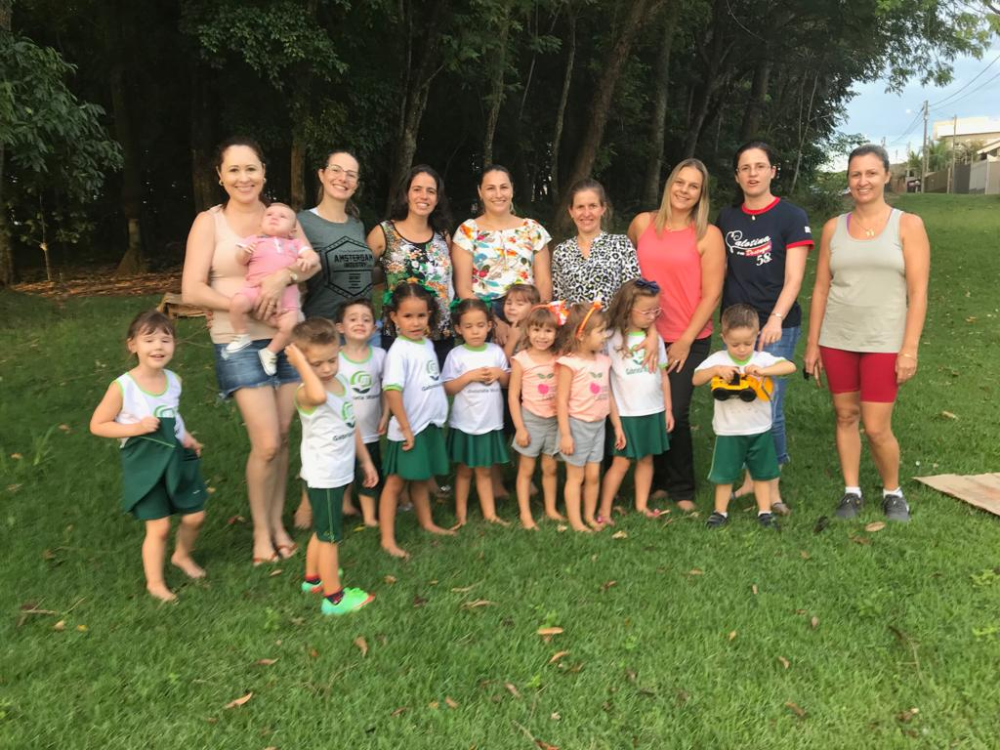
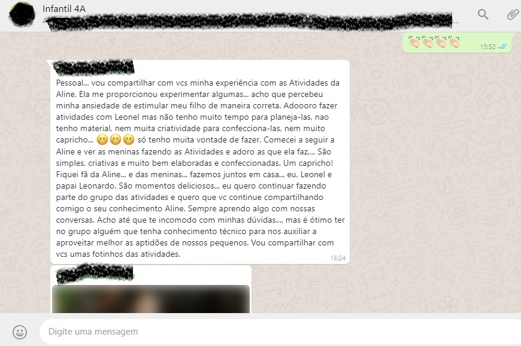
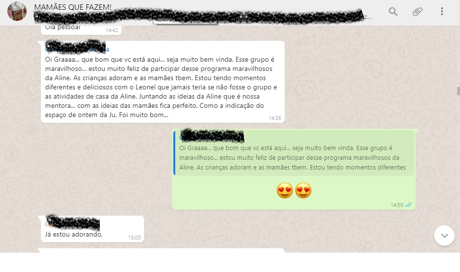
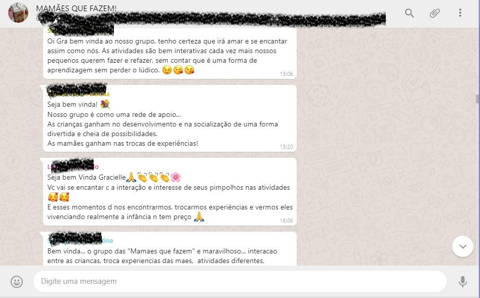
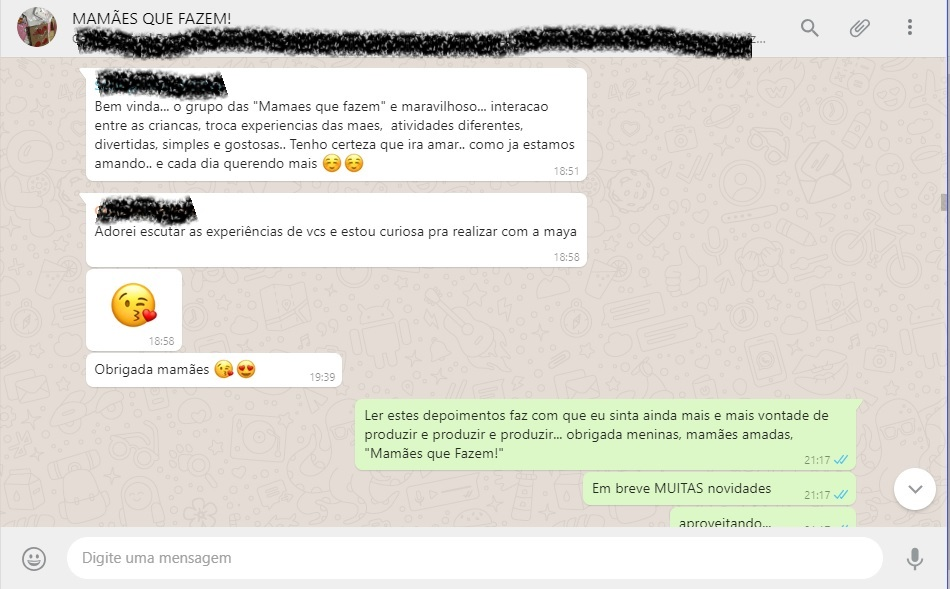

## O projeto **Mamães que Fazem** foi a forma que encontrei para dar um destino a todos os objetos pedagógicos que confecciono para trabalhar com minhas pequenas Rafa e Isa. Antes que os materiais prontos e acabados virassem lixo, deixando de ser um trabalho sustentável, surgiu a ideia de  compartilhá-los com mães e pais interessados para eles brincarem em casa com crianças de 0 à 5 anos. 

**Você pode conhecer e ver como funcionam estas brincadeiras na minha página no [Facebook](https://www.facebook.com/alinemarius)**

Ao fazer parte deste grupo as mamães renovam seus momentos com sua criança proporcionando à criança brincadeiras didáticas que visam o seu desenvolvimento psicomotor, valorizando ainda mais a relação pais e filhos, pois desta forma os laços afetivos só tendem a aumentar.

### **As mamães do grupo ajudam seus filhos a dar um grande passo na vida deles, e consequentemente, na delas também, afinal um filho realizado é sinônimo de uma mãe realizada não acha?**

Os objetivos deste projeto são:

1. Compartilhar os materiais didáticos, produzidos com muito carinho e capricho,  estimulando o psicomotor da criança e fortalecendo os laços afetivos entre mãe e filho. Ainda proporciona aos pais conhecer e reconhecer melhor sua criança bem como suas habilidades e dificuldades.

2. Permite aos pais oferecer brincadeiras diferentes à sua criança fazendo com que aqueles momentos algumas vezes vistos como “chatos” se tornem os mais agradáveis possível, pois a cada dia a criança tem uma novidade. Novidade esta, chamada por crianças que já participam, de “desafio da tia Aline”.

3. Cria momentos agradáveis para pais e filhos na comodidade do seus lares e, de quebra, de maneira sustentável, pois a maioria dos materiais foram produzidos com recicláveis.

Além de todas estas vantagens, fazer parte deste grupo MARAVILHOSO de mamães que fazem a diferença na vida de seus filhos, tem nos proporcionado MUITOS E MUITOS momentos de integração tanto entre mamães quanto entre as próprias crianças, realizando trocas de experiências maravilhosas e favorecendo o convívio entre as crianças.

Esta experiência tem sido **FANTÁSTICA** e super **POSITIVA**. 

Veja alguns depoimentos das mamães do grupo:

