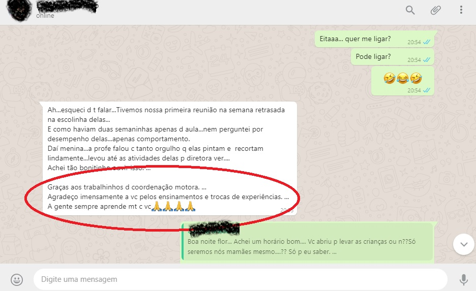

## O grupo **Mamães que Fazem!** é um grupo de ensino não formal, com o objetivo de fortalecer o vínculo afetivo entre mãe (família) e filho(a) trazendo as mamães para um mundo “pedagógico maternal” ainda desconhecido. 

## Através deste trabalho a família vai entender o nível de desenvolvimento de sua criança e descobrir aonde ela mais precisa de ajuda para se desenvolver. Desta forma, você vai prevenir futuras dificuldades que possam vir a aparecer apresentando aos seus filhos (as) um mundo acadêmico muito mais feliz.

## Realizar atividades extra sociais para o grupo também faz parte do projeto, integrando as mamães do grupo e mostrando novos ambientes que são desconhecidos das crianças e que trazem novos conhecimentos através da prática.

## Hoje o grupo é formado por quase vinte mamães e conta com a parceria da pedagoga Silvane Galgaro na produção dos materiais e planejamento e organização das visitas extras sociais.

## Algumas das atividades desse ano:

1. Homenagem ao Corpo de Bombeiros em uma visita ao quartel
2. Visita a Peretti Pisicultura (alevinos e os peixes em processo de engorda)
3. Visita ao laboratório de insetos da Universidade Federal do Paraná (insetos perigosos e os não perigosos)
4. Visita ao laboratório de plantas medicinais também na Universidade Federal do Paraná (tipos de plantas para chá medicinais)

## Ainda conta com um planejamento de visitas para este ano que, como estas, ficarão marcadas para sempre na memória destas famílias, principalmente das crianças.

**Você pode saber mais na minha página no [Facebook](https://www.facebook.com/alinemarius)**

Veja alguns depoimentos das mamães do grupo:

